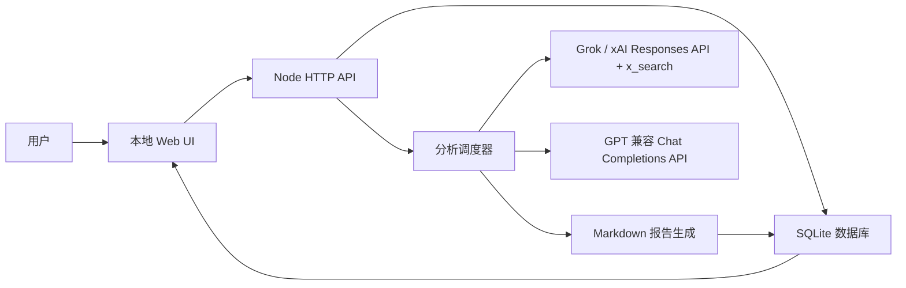
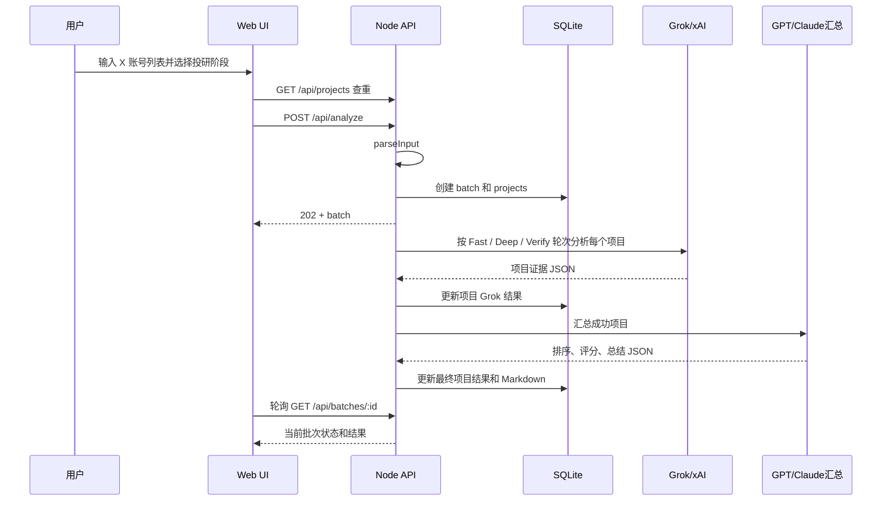

# X Token Opportunity Analyzer 项目设计文档

## 1. 项目概述

X Token Opportunity Analyzer 是一个本地个人投研工具，用于批量分析加密项目的 X 账号，辅助判断项目是否已经发币、是否存在可信 CA、TGE 进度，以及空投、积分、测试网等潜在机会。

项目当前定位为本地个人分析工具，面向人工投研和机会筛选场景。后续可以部署到个人服务器自用，但不按公开 SaaS 或多人协作产品设计。系统前期主要通过 Grok / xAI 的 X 搜索能力收集项目相关证据，再通过 GPT 或 Claude 进行归一化、排序和中文 Markdown 报告生成。

## 2. 项目目标

### 2.1 核心目标

- 当前单批默认最多 20 个 X 账号；这是运行配置上限，不是产品边界，后续根据真实 API 速度、成本、稳定性和报告质量测试结果调整。
- 对每个项目判断是否已经发币。
- 提取确认 CA、候选 CA、钱包 / 金库地址，并标注置信度。
- 判断 TGE 状态和可能时间窗口。
- 判断空投、积分、测试网、白名单、活动等机会线索。
- 对项目质量、资本背书、风险、证据可信度做独立评价，避免把“是否有 CA”混进机会评分。
- 输出按机会优先级排序的中文 Markdown 报告。

### 2.2 非目标

- 不自动进行链上交易或申领操作。
- 不替代人工最终判断。
- 不在证据不足时臆造 CA、TGE 日期或空投结论。
- 暂不面向多人协作、权限管理或公开 SaaS 部署。

## 3. 用户与使用场景

### 3.1 目标用户

- 加密项目研究人员。
- 空投 / TGE 机会筛选人员。
- 需要批量整理 X 项目信号的个人用户。

### 3.2 典型场景

1. 用户准备一批项目 X 账号。
2. 用户在本地页面粘贴账号列表。
3. 系统创建批次，逐个调用 Grok 搜索 X 证据。
4. 系统将 Grok 输出交给 GPT 或 Claude 进行统一归一化、排序和中文总结。
5. 用户在页面查看结果，并导出 Markdown 报告。

## 4. 输入格式

系统支持一行一个项目：

```text
@project
@project | Project Name | https://project.xyz | Ethereum | notes
```

字段说明：

| 字段 | 必填 | 说明 |
|---|---:|---|
| X handle | 是 | 支持 `@handle`，也支持从 `x.com/handle` 或 `twitter.com/handle` 中提取 |
| Project Name | 否 | 项目名称 |
| Website | 否 | 官方网站 |
| Chain | 否 | 所属链或生态 |
| Notes | 否 | 用户备注 |

其他规则：

- 空行忽略。
- `#` 开头的行忽略。
- 同一批输入中的重复 X 账号会去重。
- 输入时会先和项目汇总表查重；默认跳过已存在项目，需要更新旧数据时可选择重新分析全部。
- 单批数量上限由 `MAX_BATCH_SIZE` 控制，默认 20。

## 5. 系统架构

### 5.1 架构概览



### 5.2 技术栈

| 模块 | 技术 |
|---|---|
| 后端运行时 | Node.js >= 24 |
| HTTP 服务 | Node `http` 原生模块 |
| 数据库 | Node `node:sqlite` / SQLite |
| 前端 | 原生 HTML / CSS / JavaScript |
| Grok 分析 | xAI Responses API，使用 `x_search` tool；当前主要依赖该能力 |
| GPT 汇总 | OpenAI-compatible Chat Completions API |
| Claude 汇总 | Anthropic Messages API |
| 报告 | Markdown |

后续计划补充的数据源：

| 数据源 | 阶段 | 用途 |
|---|---|---|
| 官方网站 | 后续 | 校验项目身份、token 页面、公告入口 |
| Docs / GitBook | 后续 | 校验 tokenomics、TGE、airdrop、points 规则 |
| 链上浏览器 | 后续 | 校验 CA、部署合约、持有人、交易活跃度 |
| CoinGecko / CMC | 后续 | 校验已发币项目的市场数据和 CA |

## 6. 模块设计

### 6.1 后端入口

文件：[src/server.js](../src/server.js)

职责：

- 提供静态页面服务。
- 提供 `/api/*` HTTP 接口。
- 接收分析请求并创建批次。
- 提供批次详情、历史列表、统计、Markdown 下载。

### 6.2 配置模块

文件：[src/config.js](../src/config.js)

职责：

- 加载 `.env`。
- 管理端口、批次上限、并发数、mock 模式。
- 管理 xAI、GPT 兼容接口和 Claude 配置。
- 向前端暴露非敏感运行配置。

主要配置项：

| 变量 | 默认值 | 说明 |
|---|---|---|
| `PORT` | `3000` | 本地服务端口 |
| `MAX_BATCH_SIZE` | `20` | 单批最大项目数量 |
| `ANALYSIS_CONCURRENCY` | `3` | Grok 并发分析数量，代码限制为 1 到 5 |
| `MOCK_LLM` | `false` | 是否启用本地 mock 数据 |
| `XAI_API_KEY` | 空 | xAI API key |
| `XAI_BASE_URL` | `https://api.x.ai/v1` | xAI API 地址 |
| `XAI_MODEL` | `grok-4.3` | Grok 模型 |
| `GPT_API_KEY` | 空 | GPT 兼容接口 key |
| `GPT_BASE_URL` | `https://api.apikey.fun/v1` | GPT 兼容接口地址 |
| `GPT_MODEL` | `gpt-5.5` | GPT 汇总模型 |
| `CLAUDE_API_KEY` | 空 | Claude API key |
| `CLAUDE_BASE_URL` | `https://api.anthropic.com/v1` | Claude API 地址 |
| `CLAUDE_MODEL` | `claude-opus-4-7` | Claude 汇总模型 |

### 6.3 分析调度模块

文件：[src/analyzer.js](../src/analyzer.js)

职责：

- 解析用户输入。
- 创建批次和项目记录。
- 通过微任务异步启动分析流程。
- 控制 Grok 并发调用。
- 聚合成功项目并调用 GPT 或 Claude 汇总。
- 写入项目最终结果和批次 Markdown。

### 6.4 模型调用模块

文件：[src/models.js](../src/models.js)

职责：

- 调用 Grok / xAI Responses API。
- 使用 `x_search` 工具搜索 X 证据。
- 解析模型返回 JSON。
- 调用 GPT 兼容 Chat Completions API。
- 调用 Claude Messages API。
- 提供 mock 分析结果，支持本地演示和 UI 测试。

### 6.5 数据库模块

文件：[src/db.js](../src/db.js)

职责：

- 初始化 SQLite 数据库。
- 创建 `batches` 和 `projects` 表。
- 提供批次与项目的 CRUD 辅助函数。
- 提供统计数据。

### 6.6 Markdown 生成模块

文件：[src/markdown.js](../src/markdown.js)

职责：

- 为单项目生成 Markdown 片段。
- 为完整批次生成排序报告。
- 输出总览、机会表、重点机会、人工确认项目和独立项目报告。

### 6.7 前端模块

文件：

- [public/index.html](../public/index.html)
- [public/app.js](../public/app.js)
- [public/styles.css](../public/styles.css)

职责：

- 批量输入项目账号。
- 输入前检查项目汇总表中是否已有同一 X 账号。
- 创建分析批次。
- 选择 GPT 或 Claude 作为汇总模型。
- 选择快速、深度、验证三阶段投研模式。
- 轮询批次状态。
- 展示分析进度、项目表格、项目详情。
- 展示跨批次项目总览表；每个 X 账号只展示一条最新有效主记录，旧记录和失败批次默认隐藏。
- 高亮发币状态，并支持发币状态与 CA 状态双筛选。
- 发币状态筛选：全部、已发币、未发币、发币线索、需复核。
- CA 状态筛选：全部、CA 已确认、CA 待复核、无 CA。
- 两组筛选可叠加，例如“已发币 + CA 待复核”用于优先复查可能已发币但 CA 不可靠的项目。
- 从总览跳转到项目投研详情。
- X 账号跳转到对应 X 页面。
- 导出 Markdown。

## 7. 核心流程

### 7.1 批量分析流程



### 7.2 状态流转

批次状态：

| 状态 | 说明 |
|---|---|
| `queued` | 已创建，等待分析 |
| `running` | 正在进行 Grok 分析 |
| `finalizing` | Grok 阶段结束，正在生成 GPT 汇总报告 |
| `completed` | 全部成功完成 |
| `completed_with_errors` | 部分项目失败，但成功项目已生成报告 |
| `failed` | 批次失败 |

项目状态：

| 状态 | 说明 |
|---|---|
| `queued` | 已创建，等待分析 |
| `grok_running` | 正在调用 Grok |
| `grok_done` | Grok 分析完成，等待 GPT 汇总 |
| `completed` | 项目最终结果完成 |
| `failed` | 项目分析失败 |

## 8. 数据模型

### 8.1 batches

| 字段 | 说明 |
|---|---|
| `id` | 批次 ID |
| `name` | 批次名称 |
| `status` | 批次状态 |
| `total` | 项目总数 |
| `completed` | Grok 成功项目数 |
| `failed` | Grok 失败项目数 |
| `api_calls_planned` | 计划 API 请求数，当前 Fast 模式为项目数 + 1 |
| `summary_json` | GPT 汇总 JSON |
| `markdown` | 批次 Markdown 报告 |
| `error` | 批次错误信息 |
| `created_at` | 创建时间 |
| `updated_at` | 更新时间 |

### 8.2 projects

| 字段 | 说明 |
|---|---|
| `id` | 项目 ID |
| `batch_id` | 所属批次 ID |
| `input_index` | 输入顺序 |
| `x_handle` | X 账号 |
| `project_name` | 项目名称 |
| `website` | 官网 |
| `chain` | 链或生态 |
| `notes` | 用户备注 |
| `status` | 项目状态 |
| `score` | 机会评分 |
| `grade` | 机会等级 |
| `token_status` | 发币状态 |
| `ca` | 确认 CA |
| `ca_confidence` | CA 置信度 |
| `candidate_cas` | 候选 CA，存于 `grok_raw` / `final_json` |
| `wallet_addresses` | 钱包、金库、vault、team 等非 CA 地址，存于 `grok_raw` / `final_json` |
| `tge_status` | TGE 状态 |
| `tge_time` | TGE 时间线索 |
| `airdrop_status` | 空投 / 积分机会 |
| `risk_level` | 风险等级 |
| `summary` | 项目总结 |
| `grok_raw` | Grok 原始 JSON |
| `final_json` | GPT 归一化结果 |
| `markdown` | 单项目 Markdown |
| `error` | 项目错误信息 |
| `created_at` | 创建时间 |
| `updated_at` | 更新时间 |

## 9. API 设计

### 9.1 GET /api/health

健康检查。

响应：

```json
{ "ok": true }
```

### 9.2 GET /api/config

返回前端可见配置，不包含 API key。

### 9.3 GET /api/stats

返回历史批次和项目统计。

### 9.4 GET /api/batches

返回最近 50 个批次。

### 9.5 POST /api/analyze

创建分析批次。

请求：

```json
{
  "name": "Batch Name",
  "rawInput": "@project",
  "finalizer": "gpt"
}
```

响应：

```json
{
  "batch": {}
}
```

状态码：`202 Accepted`

### 9.6 GET /api/batches/:id

返回单个批次和项目列表。

### 9.7 GET /api/batches/:id/markdown

下载批次 Markdown 报告。

### 9.8 GET /api/projects

返回跨批次项目总览数据，用于 Dashboard 项目汇总表。该接口按 X 账号去重，只返回最新有效主记录；历史批次、旧记录和失败批次仍保存在数据库中，但不作为总览默认展示。

## 10. 评分与报告规则

当前系统仍保留 `score`、`grade`、`risk_level` 字段，但业务方向已经调整：

- 是否有 CA 是事实判断，不再作为“机会评分”的主要目标。
- 后续评分更适合拆成项目质量、资本背书、产品进展、市场关注度、风险等维度。
- 当前前端文案已开始向“质量分”过渡；完整评分标准仍待下一轮重构。

历史 prompt 中的评分权重仍作为临时参考：

| 维度 | 分值 |
|---|---:|
| token issuance / CA clarity | 35 |
| TGE proximity | 30 |
| airdrop / points / testnet opportunity | 15 |
| financing / backing signal from X evidence | 10 |
| recent activity | 10 |
| risk deduction | up to -30 |

等级规则当前由 GPT / Claude 输出为主；当模型未返回分数时，系统使用本地启发式兜底评分。

本地等级兜底规则：

| 分数 | 等级 |
|---:|---|
| >= 90 | S |
| >= 80 | A |
| >= 70 | B |
| >= 50 | C |
| < 50 | D |

## 11. 证据与可靠性原则

- CA 只有在官方 X、官网 / docs、官方公告、可信浏览器、CoinGecko 或 CMC 确认时才能标为 confirmed。
- 证据不足时，CA 应为空或进入候选 CA，不得臆造。
- bio、帖子或链接中出现的地址如果无法判断为 token 合约，应进入候选 CA 或钱包 / 金库地址，不应直接写入确认 CA。
- TGE 没有明确日期时，不得猜测精确时间。
- 优先使用近期动态和官方信息。
- 最终报告需要保留证据来源、结论和置信度。

## 12. 当前实现状态

| 功能 | 状态 | 说明 |
|---|---|---|
| 本地 Web UI | 已实现 | 批量输入、示例填充、状态展示 |
| 后端 API | 已实现 | 基础 API 已完成 |
| SQLite 持久化 | 已实现 | `data/app.db` |
| Mock 模式 | 已实现 | 支持无外部 API 本地测试 |
| Grok X 搜索 | 已实现 | 依赖 xAI Responses API |
| GPT 汇总报告 | 已实现 | 依赖 GPT 兼容 Chat Completions API |
| Claude 汇总报告 | 已实现 | 可在分析页选择 Claude |
| Markdown 导出 | 已实现 | 批次报告下载 |
| 历史报告 | 已实现 | 最近 50 个批次 |
| 项目总览 | 已实现 | 跨批次项目表、项目简介、地址摘要、投研跳转、去重主表 |
| 输入查重 | 已实现 | 输入账号会先和项目汇总表比对，默认跳过重复项目，可强制重新分析 |
| 发币/CA 双筛选 | 已实现 | 批次结果页和项目总览页均支持发币状态、CA 状态叠加筛选 |
| 地址三分类 | 已实现 | 确认 CA、候选 CA、钱包 / 金库地址 |
| 自动化测试 | 未完善 | 当前主要依赖 `npm run check` 和 smoke 数据 |
| 页面验收 | 进行中 | 已在本地页面验证总览、历史、投研跳转、模型切换 |
| 真实 API 联调 | 已开始 | Grok + GPT、Grok + Claude 汇总链路均已 smoke test |
| GPT / Claude 切换 | 已实现 | 分析页可选择 GPT 或 Claude 作为最终汇总模型 |
| 分级投研按钮 | 已实现最小版 | Fast=1轮 Grok，Deep=2轮 Grok，Verify=3轮 Grok，最后统一 GPT/Claude 汇总 |
| 部署方案 | 待设计 | 当前按本地工具设计，后续考虑个人服务器自用部署 |

## 13. 已知风险与限制

- Node `node:sqlite` 当前仍可能显示 ExperimentalWarning。
- 项目没有鉴权，不适合直接暴露到公网。
- 真实 API 成本和限流策略尚未系统化。
- 批次运行状态仅存在于当前 Node 进程，服务重启后不会自动恢复未完成批次。
- 当前缺少自动重试、取消任务、暂停任务等任务控制能力。
- 当前只有轻量请求重试，尚未记录完整调用日志和成本估算。
- 当前缺少系统化测试，包括输入解析、API、DB migration、Markdown 生成和前端交互测试。
- 模型输出 JSON 虽有解析兜底，但仍可能因为模型格式漂移导致失败。

## 14. 已确认决策与待确认问题

### 14.1 已确认决策

- 产品形态：只做本地个人工具，后续可部署到个人服务器自用。
- 部署边界：不按公开 SaaS 或多人协作系统设计。
- 批量上限：单批 20 个账号是当前配置限制，后续根据实际测试情况调整。
- 数据源策略：前期主要依赖 Grok API 的 X 搜索能力；后续加入官网、docs、链上浏览器、CoinGecko / CMC 等数据源。
- API 进度：真实 API 已跑通，后续重点是报告质量评估和错误处理。
- 验收方式：先看页面，测试不同类型 X 账号，检查返回报告质量；同时确认 GPT 和 Claude 相关模型 / 接口方案。
- 分析层级：Fast / Deep / Verify 三段式已实现最小版；Deep / Verify 会增加 Grok 审计轮数，成本和耗时更高。

### 14.2 产品范围待确认

- 项目的核心使用语言是否固定为中文报告？
- 后续个人服务器部署是否需要登录保护、IP 白名单或反向代理鉴权？

### 14.3 分析标准

- `S/A/B/C/D` 等级是否继续保留，还是改成项目质量评级？
- 质量分、资本背书、风险是否拆成独立维度？
- “高优先级项目”的阈值是否继续定义为 `S/A`，还是改为事实标签组合？
- CA 确认为真的来源白名单是否需要扩大或收窄？
- TGE 临近的判断窗口应该是多少，例如 30 天、90 天、季度内？

### 14.4 技术决策

- GPT 兼容接口是否长期使用 `apikey.fun`，还是只是当前开发环境？
- Grok 模型 `grok-4.3` 和 GPT 模型 `gpt-5.5` 是否是目标配置？
- Claude 当前作为 GPT 汇总模型的替代选项；后续如有需要再增加二次评审模式。
- 是否需要引入 npm 依赖，例如 Express、测试框架或前端构建工具？
- 是否需要数据库 migration 机制？

### 14.5 进度与验收

- 当前已有的 3 个 smoke 批次是否可作为验收记录保留？
- 下一阶段优先做功能增强、准确率优化、测试补齐，还是 UI/报告体验优化？

## 15. 后续迭代建议

### 15.1 P0

- 继续积累 Grok + GPT / Claude 真实 API 样本。
- 明确正式报告质量验收标准。
- 重构评分体系：CA 作为事实判断，项目质量 / 资本背书 / 风险作为评价维度。
- 继续评估 Fast / Deep / Verify 的真实效果、成本和耗时，必要时再拆成单项目二次审计按钮。
- 接入官网、docs、链上浏览器、CoinGecko / CMC，形成 X 搜索之外的二次校验链路。
- 增加输入解析和 Markdown 生成的自动测试。
- 增加模型失败、JSON 解析失败、API 限流失败的错误展示和重试策略。

### 15.2 P1

- 增加批次取消 / 重新运行失败项目。
- 增加报告详情页或单项目 Markdown 导出。
- 增加来源白名单和证据可靠性配置。
- 增加成本估算和调用日志。
- 设计个人服务器部署方式和最小访问保护。

### 15.3 P2

- 支持更多数据源。
- 支持任务恢复。
- 支持部署模式、鉴权和多用户隔离。
- 引入更完整的测试框架和 CI。
